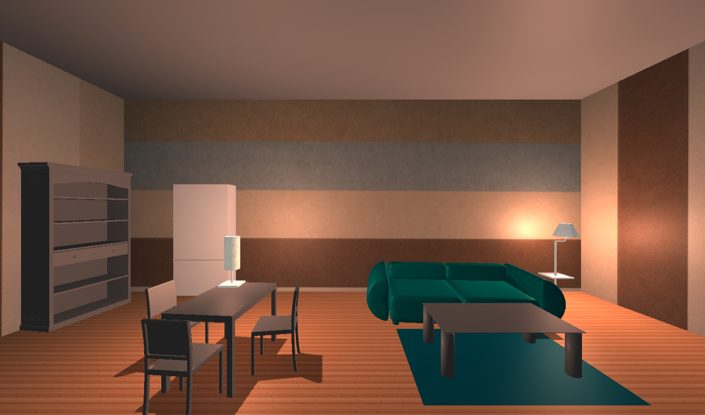
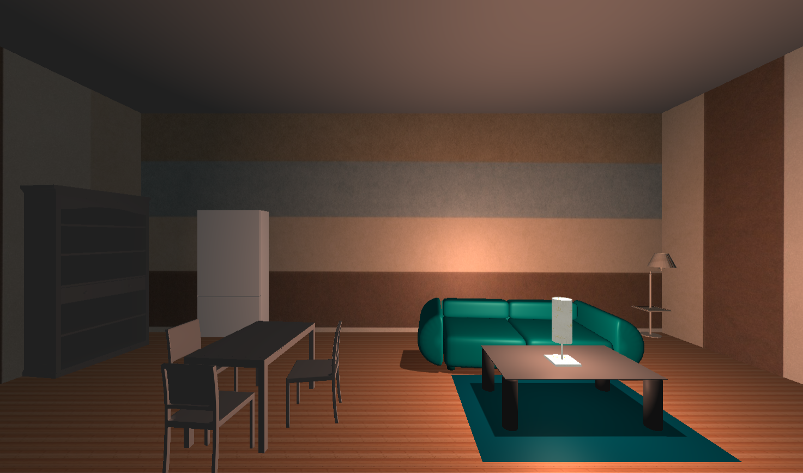

# 3D_lightonline_demo
A demo of 3D lighting in a room space in Javascript and three.js

This 3D demo was made in the heat of a partnership between school HEC and school 42, on the e-commerce theme. How to make a site with little visibility the flagship of the domain ? That was the question asked in this challenge. In our team, we found several ideas, including the online 3D space idea, that is this demo that I created. In this demo, made in javascript with the three.js library, a user can place lamps in a room to see how the light actually works in an environment. The idea was to give the user the possibility to try a lamp before buying it.

